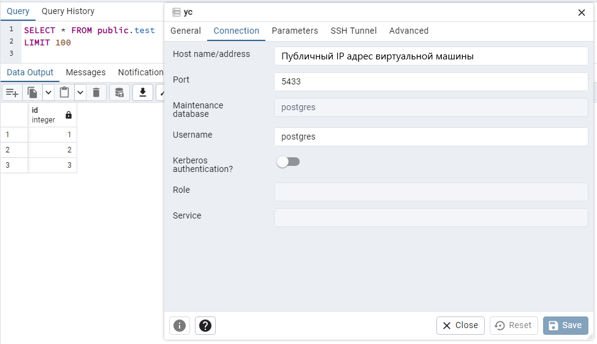

# Установка PostgreSQL

## 1. Настройка

1. Запускаем существующую виртуальную машину и забираем новый внешний IP

```pwsh
PS C:\Users\Mamaev Konstantin> yc compute instance start kmamaev
done (20s)
```

2. Подключаемся к виртуальной машине по ssh

```pwsh
PS C:\Users\Mamaev Konstantin> ssh kmamaev@{IP}

...

kmamaev@kmamaev:~$
```

3. Устанавливаем Docker Engine по [официальной инструкции](https://docs.docker.com/engine/install/ubuntu/#install-using-the-repository). Запускаем hello-world контейнер, чтобы проверить, что все работает, а после этого удаляем его

```bash
kmamaev@kmamaev:~$ sudo docker run hello-world

Hello from Docker!
This message shows that your installation appears to be working correctly.

kmamaev@kmamaev:~$ sudo docker ps -a
CONTAINER ID   IMAGE         COMMAND    CREATED         STATUS                     PORTS     NAMES
fcc2680c9307   hello-world   "/hello"   5 seconds ago   Exited (0) 4 seconds ago             optimistic_heisenberg

kmamaev@kmamaev:~$ sudo docker rm optimistic_heisenberg
optimistic_heisenberg

kmamaev@kmamaev:~$ sudo docker ps -a
CONTAINER ID   IMAGE     COMMAND   CREATED   STATUS    PORTS     NAMES
```

4. Создаем рабочую директорию, где будут хранится данные нашего кластера

```bash
kmamaev@kmamaev:~$ sudo mkdir /var/lib/postgres
```

## 2. Практическая часть

1. Разворачиваем контейнер с `postgres`

Для этого воспользуемся документацией [образа postgres](https://hub.docker.com/_/postgres), [команды запуска в docker](https://docs.docker.com/engine/reference/commandline/container_run/) и [разделов в docker](https://docs.docker.com/storage/volumes/). Не забываем назначить внешний порт `5433`, если `5432` занят локальным кластером `postgres` на виртуальной машине. Не указываю никакой сети, потому что хотел воспользоваться стандартной `bridge` сетью

```bash
kmamaev@kmamaev:~$ sudo docker run -d \
        --name docker-postgres \
        -p 5433:5432 \
        -e POSTGRES_PASSWORD=111111 \
        -e PGDATA=/var/lib/postgresql/data/pgdata \
        -v /var/lib/postgres:/var/lib/postgresql/data/pgdata \
        postgres
```
> **Примечание**: Оказывает привязать раздел к docker контейнеру настройкой `-v /var/lib/postgres:/var/lib/postgresql` будет ошибкой, так как данные после удаления контейнера будут очищаться. Надо привязывать либо конретно `/var/lib/postgresql/data`, либо задавать кастомный путь `PGDATA`. Я сильно глубоко не копал, но если правильно понял, то под капотом у образа `postgres` родительская папка  `/var/lib/postgresql` монтируется для внутренних нужд и поэтому плохо работает при привязке наружу. Вот [пример](https://github.com/docker-library/postgres/issues/952) такой проблемы у других людей. Я в итоге сделал с настройкой `PGDATA`

2. Разворачиваем контейнер с клиентом `postgres`

> **Примечание**: Здесь я почему-то решил, что под клиентом `postgres` имеется ввиду что-то типа `pgAdmin` и поэтому развернул образ с ним. Оглядываясь назад, понимаю, что можно было поставить также образ с `postgres` и использовать `psql`, но в итоге оказалось, что `psql` есть в составе образа `pgAdmin`, так что в итоге никаких проблем с таким выбором не было

Для этого воспользуемся документацией [образа pgAdmin](https://hub.docker.com/r/dpage/pgadmin4) и [дистрибутива pgAdmin](https://www.pgadmin.org/docs/pgadmin4/latest/container_deployment.html)

```bash
kmamaev@kmamaev:~$ sudo docker run -d \
    --name docker-pgadmin4 \
    -p 80:80 \
    -e 'PGADMIN_DEFAULT_EMAIL=pgadmin4@yandex.com' \
    -e 'PGADMIN_DEFAULT_PASSWORD=111111' \
    dpage/pgadmin4
```

3. Проверим состояние контейнеров

```bash
kmamaev@kmamaev:~$ sudo docker ps -a
CONTAINER ID   IMAGE            COMMAND                  CREATED          STATUS          PORTS                                        NAMES
ae668637e4d0   dpage/pgadmin4   "/entrypoint.sh"         10 seconds ago   Up 9 seconds    0.0.0.0:80->80/tcp, :::80->80/tcp, 443/tcp   docker-pgadmin4
5a58b7e92158   postgres         "docker-entrypoint.s…"   32 seconds ago   Up 32 seconds   5432/tcp                                     docker-postgres
```

> **Примечание**: Еще ради интереса открыл веб-интерфейс `pgAdmin4` со своего компьютера, то есть вне контейнера и вне виртуальной машины. Все работает, доступен по внешнему IP виртуальной машины http://{IP}/browser/. Скрин не стал прикладывать, обычное окно `pgAdmin4`, ниже будет скрин с реальными данными и подключением

4. Подключимся из контейнера с клиентом к контейнеру с сервером

Почитал документацию про [сети в docker](https://docs.docker.com/network/network-tutorial-standalone/). Оказывается все контейнеры запущенные в `docker` по умолчанию подключены к сети `bridge`. Посмотрим список всех сетей

```bash
kmamaev@kmamaev:~$ sudo docker network ls
NETWORK ID     NAME      DRIVER    SCOPE
380506ba4232   bridge    bridge    local
4ecbfc7b2a30   host      host      local
47abd0434f03   none      null      local
```

Получил IP адреса контейнеров в сети `bridge`

```bash
kmamaev@kmamaev:~$ sudo docker inspect docker-postgres | grep '"IPAddress":' -m 1
            "IPAddress": "172.17.0.2",
kmamaev@kmamaev:~$ sudo docker inspect docker-pgadmin4 | grep '"IPAddress":' -m 1
            "IPAddress": "172.17.0.3",
```

Подключился к `bash` контейнера с клиентом `postgres`

```bash
kmamaev@kmamaev:/var/lib/postgres$ sudo docker exec -it docker-pgadmin4 sh
/pgadmin4 $
```

Подключился к кластеру другого контейнера

```bash
/pgadmin4 $ /usr/local/pgsql-16/psql --host 172.17.0.2 --username=postgres
```

> **Примечание**: В контейнере `pgAdmin4` `psql` по умолчанию недоступна отовсюду, видимо не зарегистрирована в путях окружения, поэтому обращаюсь по полному пути `/usr/local/pgsql-16/psql`. Подозреваю, что можно было бы `PATH` обновить, но так было быстрее

5. Создадим базу данных, таблицу и заполним ее данными

Тут все предельно просто

```sql
postgres=# create database test;
CREATE DATABASE
postgres=# \l
                                                      List of databases
   Name    |  Owner   | Encoding | Locale Provider |  Collate   |   Ctype    | ICU Locale | ICU Rules |   Access privileges
-----------+----------+----------+-----------------+------------+------------+------------+-----------+-----------------------
 postgres  | postgres | UTF8     | libc            | en_US.utf8 | en_US.utf8 |            |           |
 template0 | postgres | UTF8     | libc            | en_US.utf8 | en_US.utf8 |            |           | =c/postgres          +
           |          |          |                 |            |            |            |           | postgres=CTc/postgres
 template1 | postgres | UTF8     | libc            | en_US.utf8 | en_US.utf8 |            |           | =c/postgres          +
           |          |          |                 |            |            |            |           | postgres=CTc/postgres
 test      | postgres | UTF8     | libc            | en_US.utf8 | en_US.utf8 |            |           |
(4 rows)

postgres=# \c test
psql (16.1, server 16.2 (Debian 16.2-1.pgdg120+2))
You are now connected to database "test" as user "postgres".

test=# create table test (id int);
CREATE TABLE
test=# insert into test values (1), (2), (3);
INSERT 0 3
test=# select * from test;
 id
----
  1
  2
  3
(3 rows)
```

6. Подключимся к контейнеру с сервером с удаленного компьютера

Я подключился просто из локального `pgAdmin4` с использованием внешнего IP виртуальной машины и порта 5433

Скриншот pgAdmin 4, подключенного к тестовой БД</img>

7. Удаляем контейнер с `postgres`

Запросим данные в папке `/var/lib/postgres` перед удалением, чтобы убедиться, что вообще хоть что-то сохранилось в раздел, который мы подключали

```bash
kmamaev@kmamaev:~$ sudo ls -1 /var/lib/postgres
base
global
pg_commit_ts
pg_dynshmem
pg_hba.conf
pg_ident.conf
pg_logical
pg_multixact
pg_notify
pg_replslot
pg_serial
pg_snapshots
pg_stat
pg_stat_tmp
pg_subtrans
pg_tblspc
pg_twophase
PG_VERSION
pg_wal
pg_xact
postgresql.auto.conf
postgresql.conf
postmaster.opts
postmaster.pid
```

Удалим контейнер

```bash
kmamaev@kmamaev:~$ sudo docker stop docker-postgres && sudo docker rm docker-postgres
docker-postgres
docker-postgres
kmamaev@kmamaev:~$ sudo docker ps -a
CONTAINER ID   IMAGE            COMMAND            CREATED          STATUS          PORTS                                        NAMES
ae668637e4d0   dpage/pgadmin4   "/entrypoint.sh"   45 minutes ago   Up 45 minutes   0.0.0.0:80->80/tcp, :::80->80/tcp, 443/tcp   docker-pgadmin4
```

8. Пересоздаем контейнер с кластером заново и переподключаемся к нему. Проверяем, что данные пережили удаление контейнера

Создаем контейнер и подключаемся к кластеру

```bash
kmamaev@kmamaev:~$ sudo docker run -d \
        -p 5433:5432 \
        --name docker-postgres \
        -e POSTGRES_PASSWORD=111111 \
        -e PGDATA=/var/lib/postgresql/data/pgdata \
        -v /var/lib/postgres:/var/lib/postgresql/data/pgdata \
        postgres
2f2a6fd3c8e50b01a133314d0f7936793760f25e9def3e405906ba10df6c8f34

kmamaev@kmamaev:~$ sudo docker exec -it docker-pgadmin4 sh

/pgadmin4 $ /usr/local/pgsql-16/psql --host 172.17.0.2 --username=postgres
Password for user postgres:
psql (16.1, server 16.2 (Debian 16.2-1.pgdg120+2))
Type "help" for help.
```

Проверяем данные в БД

```sql
postgres=# \l
                                                      List of databases
   Name    |  Owner   | Encoding | Locale Provider |  Collate   |   Ctype    | ICU Locale | ICU Rules |   Access privileges
-----------+----------+----------+-----------------+------------+------------+------------+-----------+-----------------------
 postgres  | postgres | UTF8     | libc            | en_US.utf8 | en_US.utf8 |            |           |
 template0 | postgres | UTF8     | libc            | en_US.utf8 | en_US.utf8 |            |           | =c/postgres          +
           |          |          |                 |            |            |            |           | postgres=CTc/postgres
 template1 | postgres | UTF8     | libc            | en_US.utf8 | en_US.utf8 |            |           | =c/postgres          +
           |          |          |                 |            |            |            |           | postgres=CTc/postgres
 test      | postgres | UTF8     | libc            | en_US.utf8 | en_US.utf8 |            |           |
(4 rows)

postgres=# \c test
psql (16.1, server 16.2 (Debian 16.2-1.pgdg120+2))
You are now connected to database "test" as user "postgres".
test=# select * from test;
 id
----
  1
  2
  3
(3 rows)
```

Проверяем данные в папке `/var/lib/postgres` по количеству файлов

```bash
kmamaev@kmamaev:~$ sudo ls /var/lib/postgres | wc -l
24
```

9. Дополнительно посмотрим как работает создание новой сети в `doсker`

Я в итоге сделал задание в рамках стандартной сети контейнеров, но судя по всему задумывалось создание своей сети для работы между контейнерами

Заранее удалил оба контейнера командами `stop` и `rm`, а теперь создадим сеть

```bash
kmamaev@kmamaev:~$ sudo docker network create test
9019bd9215e10baaa2d172a9f17f1ef09ff51996d9c41bdbbc8e0df90ffb669c
```

Создадим два контейнера с сетью `test`

```bash
kmamaev@kmamaev:~$ sudo docker run -d \
        --name docker-postgres \
        -p 5433:5432 \
        -e POSTGRES_PASSWORD=111111 \
        -e PGDATA=/var/lib/postgresql/data/pgdata \
        -v /var/lib/postgres:/var/lib/postgresql/data/pgdata \
        --network=test \
        postgres
```

```bash
kmamaev@kmamaev:~$ sudo docker run -p 80:80 \
    --name docker-pgadmin4 \
    -e 'PGADMIN_DEFAULT_EMAIL=pgadmin4@yandex.com' \
    -e 'PGADMIN_DEFAULT_PASSWORD=111111' \
    --network=test \
    -d dpage/pgadmin4
```

Посмотрим как теперь выглядит сеть в `docker`

```bash
kmamaev@kmamaev:~$ sudo docker network ls
NETWORK ID     NAME      DRIVER    SCOPE
380506ba4232   bridge    bridge    local
4ecbfc7b2a30   host      host      local
47abd0434f03   none      null      local
9019bd9215e1   test      bridge    local
```

Более подробно посмотрим на сеть `test`

```bash
kmamaev@kmamaev:~$ sudo docker network inspect test
[
    {
        "Name": "test",
        "Id": "9019bd9215e10baaa2d172a9f17f1ef09ff51996d9c41bdbbc8e0df90ffb669c",
        "Created": "2024-02-23T18:55:40.061060158Z",
        "Scope": "local",
        "Driver": "bridge",
        "EnableIPv6": false,
        "IPAM": {
            "Driver": "default",
            "Options": {},
            "Config": [
                {
                    "Subnet": "172.18.0.0/16",
                    "Gateway": "172.18.0.1"
                }
            ]
        },
        "Internal": false,
        "Attachable": false,
        "Ingress": false,
        "ConfigFrom": {
            "Network": ""
        },
        "ConfigOnly": false,
        "Containers": {
            "1af2e7c9c50ad31979105fa5d5c95b5402dd5670c0d1c6d60322bb8a984092ee": {
                "Name": "docker-pgadmin4",
                "EndpointID": "da826b3d2feeacb1246cd53c387be48d5fdef33d44c5c14a39538c06793203ff",
                "MacAddress": "02:42:ac:12:00:03",
                "IPv4Address": "172.18.0.3/16",
                "IPv6Address": ""
            },
            "abc9eff5764235047d13f3d5f31d0dc2098185e1bceebff8fcc9047dcda9a3f9": {
                "Name": "docker-postgres",
                "EndpointID": "9581105889fbbf59c4d2053d1a815e674ef98729997949f846bc199fbe23f182",
                "MacAddress": "02:42:ac:12:00:02",
                "IPv4Address": "172.18.0.2/16",
                "IPv6Address": ""
            }
        },
        "Options": {},
        "Labels": {}
    }
]
```

Подключимся к кластеру из контейнера с клиентом

```bash
kmamaev@kmamaev:~$ sudo docker exec -it docker-pgadmin4 sh
/pgadmin4 $  /usr/local/pgsql-16/psql -h docker-postgres --username=postgres
Password for user postgres:
psql (16.1, server 16.2 (Debian 16.2-1.pgdg120+2))
Type "help" for help.

postgres=# \conninfo
You are connected to database "postgres" as user "postgres" on host "docker-postgres" (address "172.18.0.2") at port "5432".
```