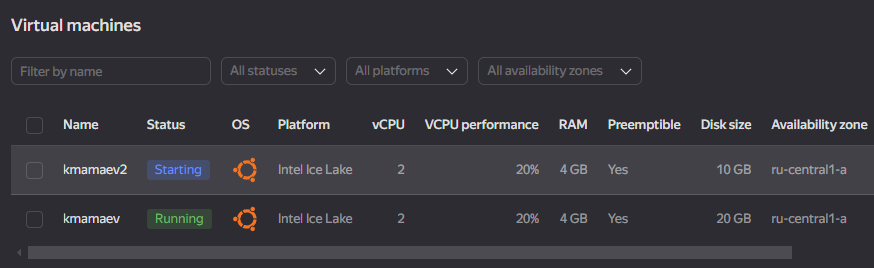

# Физический уровень PostgreSQL

## 1. Настройка

### 1.1 Добавим тестовые данные в бд кластера

1.1.1 Запустим виртуальную машину

```pwsh
PS C:\Users\Mamaev Konstantin> yc compute instance start kmamaev
done (19s)
```

1.1.2 Подключимся к виртуальной машине по `ssh`

1.1.3 Подключимся к кластеру

```bash
kmamaev@kmamaev:~$ sudo -u postgres pg_lsclusters
Ver Cluster Port Status Owner    Data directory              Log file
16  main    5432 online postgres /var/lib/postgresql/16/main /var/log/postgresql/postgresql-16-main.log

kmamaev@kmamaev:~$ sudo psql -h 127.0.0.1 -U postgres
```

1.1.4 Создадим новую базу данных

```sql
postgres=# create database test;
CREATE DATABASE
```

1.1.5 Создадим новую таблицу и заполинм ее данными

```sql
postgres=# \c test
SSL connection (protocol: TLSv1.3, cipher: TLS_AES_256_GCM_SHA384, compression: off)
You are now connected to database "test" as user "postgres".

test=# create table test (id int);
CREATE TABLE

test=# insert into test values (1), (2), (3), (4);
INSERT 0 4

test=# select * from test;
 id
----
  1
  2
  3
  4
(4 rows)
```

### 1.2 Подключим новый диск к виртуальной машине

1.2.1 Посмотрим список текущих дисков

```pwsh
PS C:\Users\Mamaev Konstantin> yc compute disk list
+----------------------+------+-------------+---------------+--------+----------------------+-----------------+-------------+
|          ID          | NAME |    SIZE     |     ZONE      | STATUS |     INSTANCE IDS     | PLACEMENT GROUP | DESCRIPTION |
+----------------------+------+-------------+---------------+--------+----------------------+-----------------+-------------+
| fhmurrun78jcaqpeckah |      | 10737418240 | ru-central1-a | READY  | fhmkkf4s9vuoaq6jv5cp |                 |             | 
+----------------------+------+-------------+---------------+--------+----------------------+-----------------+-------------+
```

1.2.2 Создадим новый диск

```pwsh
PS C:\Users\Mamaev Konstantin> yc compute disk create test --size=10
done (8s)

PS C:\Users\Mamaev Konstantin> yc compute disk list
+----------------------+------+-------------+---------------+--------+----------------------+-----------------+-------------+
|          ID          | NAME |    SIZE     |     ZONE      | STATUS |     INSTANCE IDS     | PLACEMENT GROUP | DESCRIPTION |
+----------------------+------+-------------+---------------+--------+----------------------+-----------------+-------------+
| fhmqiv72ecvnl2e5tru8 | test | 10737418240 | ru-central1-a | READY  |                      |                 |             |
| fhmurrun78jcaqpeckah |      | 10737418240 | ru-central1-a | READY  | fhmkkf4s9vuoaq6jv5cp |                 |             |
+----------------------+------+-------------+---------------+--------+----------------------+-----------------+-------------+
```

1.2.3 Присоединим новый диск к виртуальной машине

```pwsh
PS C:\Users\Mamaev Konstantin> yc compute instance attach-disk --name kmamaev --disk-name test
done (11s)

PS C:\Users\Mamaev Konstantin> yc compute disk list
+----------------------+------+-------------+---------------+--------+----------------------+-----------------+-------------+
|          ID          | NAME |    SIZE     |     ZONE      | STATUS |     INSTANCE IDS     | PLACEMENT GROUP | DESCRIPTION |
+----------------------+------+-------------+---------------+--------+----------------------+-----------------+-------------+
| fhmqiv72ecvnl2e5tru8 | test | 10737418240 | ru-central1-a | READY  | fhmkkf4s9vuoaq6jv5cp |                 |             |
| fhmurrun78jcaqpeckah |      | 10737418240 | ru-central1-a | READY  | fhmkkf4s9vuoaq6jv5cp |                 |             |
+----------------------+------+-------------+---------------+--------+----------------------+-----------------+-------------+
```

> **Примечание**: Обратим внимание, что у диска `test` теперь `INSTANCE IDS` не пустой, а заполнен таким же значением, как и исходный диск. Это значит, что диск был успешно подключен

### 1.3 Смонтируем новый диск

1.3.1 Посмотрим информацию о дисках на виртуальной машине

```bash
kmamaev@kmamaev:~$ sudo fdisk -l

...

Disk /dev/vda: 10 GiB, 10737418240 bytes, 20971520 sectors
Units: sectors of 1 * 512 = 512 bytes
Sector size (logical/physical): 512 bytes / 4096 bytes
I/O size (minimum/optimal): 4096 bytes / 4096 bytes
Disklabel type: gpt
Disk identifier: 76209B49-C05A-4E13-B7E6-9FFFBC929BD3

Device     Start      End  Sectors Size Type
/dev/vda1   2048     4095     2048   1M BIOS boot
/dev/vda2   4096 20971486 20967391  10G Linux filesystem


Disk /dev/vdb: 10 GiB, 10737418240 bytes, 20971520 sectors
Units: sectors of 1 * 512 = 512 bytes
Sector size (logical/physical): 512 bytes / 4096 bytes
I/O size (minimum/optimal): 4096 bytes / 4096 bytes
```

> **Примечание**: Обратим внимание, что у первого диска видно список разделов `/dev/vda1` и `/dev/vda2`, а также что использовался `gpt` (GUID Partition Table). При этом у нового диска разделов еще нет

1.3.2 Создадим раздел на диске `/dev/vdb`

```bash
kmamaev@kmamaev:~$ sudo parted /dev/vdb mklabel gpt
Information: You may need to update /etc/fstab.

kmamaev@kmamaev:~$ sudo parted -a opt /dev/vdb mkpart primary ext4 0% 100%
Information: You may need to update /etc/fstab.

kmamaev@kmamaev:~$ lsblk
NAME   MAJ:MIN RM   SIZE RO TYPE MOUNTPOINTS

...

vda    252:0    0    10G  0 disk
├─vda1 252:1    0     1M  0 part
└─vda2 252:2    0    10G  0 part /
vdb    252:16   0    10G  0 disk
└─vdb1 252:17   0    10G  0 part

kmamaev@kmamaev:~$ sudo mkfs.ext4 -L datapartition /dev/vdb1
mke2fs 1.46.5 (30-Dec-2021)
Creating filesystem with 2620928 4k blocks and 655360 inodes
Filesystem UUID: 45842af6-7531-4d18-9bfb-83df32ad4939
Superblock backups stored on blocks:
        32768, 98304, 163840, 229376, 294912, 819200, 884736, 1605632

Allocating group tables: done
Writing inode tables: done
Creating journal (16384 blocks): done
Writing superblocks and filesystem accounting information: done
```

1.3.3 Создадим новую папку, куда будем монтировать

```bash
kmamaev@kmamaev:~$ sudo mkdir -p /mnt/data
```

1.3.4 Смонтируем раздел диска к папке системы

```bash
kmamaev@kmamaev:~$ sudo mount -o defaults /dev/vdb1 /mnt/data
```

1.3.5 Настроим автоматическое присоединение диска на старте системы

```bash
kmamaev@kmamaev:~$ sudo nano /etc/fstab
```

Прописываем в файле конфигурации

```
/dev/disk/by-uuid/ed465c6e-049a-41c6-8e0b-c8da348a3577 / ext4 defaults 0 1
/dev/disk/by-uuid/45842af6-7531-4d18-9bfb-83df32ad4939 /mnt/data ext4 defaults 0 2
```

1.3.6 Проверяем состояние нового диска и перезагружаем машину

```bash
kmamaev@kmamaev:~$ df -h -x tmpfs
Filesystem      Size  Used Avail Use% Mounted on
/dev/vda2       9.8G  6.9G  2.5G  74% /
/dev/vdb1       9.8G   24K  9.3G   1% /mnt/data

kmamaev@kmamaev:~$ sudo reboot
```

После перезагрузки еще раз проверяем список разделов

```bash
kmamaev@kmamaev:~$ df -h -x tmpfs
Filesystem      Size  Used Avail Use% Mounted on
/dev/vda2       9.8G  6.9G  2.5G  74% /
/dev/vdb1       9.8G   28K  9.3G   1% /mnt/data
```

1.3.7 Предоставим права пользователю `postgres` на папку `/mnt/data/`

```bash
kmamaev@kmamaev:~$ sudo chown -R postgres:postgres /mnt/data/
```

## 2. Практическая часть

### 2.1 Перенесем данные кластера на новый диск

2.1.1 Остановим кластер

```bash
kmamaev@kmamaev:~$ sudo -u postgres pg_ctlcluster 16 main stop

kmamaev@kmamaev:~$ sudo -u postgres pg_lsclusters
Ver Cluster Port Status Owner    Data directory              Log file
16  main    5432 down   postgres /var/lib/postgresql/16/main /var/log/postgresql/postgresql-16-main.log
```

2.1.2 Перенесем данные из папки `/var/lib/postgresql/16` в `/mnt/data`

```bash
kmamaev@kmamaev:~$ sudo mv /var/lib/postgresql/16 /mnt/data

kmamaev@kmamaev:~$ sudo -u postgres pg_lsclusters
Ver Cluster Port Status Owner     Data directory              Log file
16  main    5432 down   <unknown> /var/lib/postgresql/16/main /var/log/postgresql/postgresql-16-main.log
```
> **Примечание**: Обратим внимание, что `Owner` принял значение `<unknown>`. Возможно, реальное объяснение немного другое, но складывается ощущение, что владелец кластера определяется по владельцу папки или по конфигурационному файлу, которого теперь нет по пути `/var/lib/postgresql/16/main`

2.1.3 Попробуем запустить кластер

```bash
kmamaev@kmamaev:~$ sudo -u postgres pg_ctlcluster 16 main start
Error: /var/lib/postgresql/16/main is not accessible or does not exist
```

Запустить не удалось и ошибка явно говорит о том, что путь `/var/lib/postgresql/16/main` не доступен или не существует

2.1.4 Поменяем значение конфигурации `Data directory`

```bash
kmamaev@kmamaev:~$ sudo ls /etc/postgresql/16/main
conf.d  environment  pg_ctl.conf  pg_hba.conf  pg_ident.conf  postgresql.conf  start.conf

kmamaev@kmamaev:~$ sudo nano /etc/postgresql/16/main/postgresql.conf
```

Заполним значение так

```
# The default values of these variables are driven from the -D command-line
# option or PGDATA environment variable, represented here as ConfigDir.

data_directory = '/mnt/data' #'/var/lib/postgresql/16/main'             # use data in another directory
                                        # (change requires restart)
hba_file = '/etc/postgresql/16/main/pg_hba.conf'        # host-based authentication file
                                        # (change requires restart)
ident_file = '/etc/postgresql/16/main/pg_ident.conf'    # ident configuration file
                                        # (change requires restart)
```

Попробуем запустить кластер

```bash
kmamaev@kmamaev:~$ sudo -u postgres pg_ctlcluster 16 main start
Warning: the cluster will not be running as a systemd service. Consider using systemctl:
  sudo systemctl start postgresql@16-main
Error: /usr/lib/postgresql/16/bin/pg_ctl /usr/lib/postgresql/16/bin/pg_ctl start -D /mnt/data -l /var/log/postgresql/postgresql-16-main.log -s -o  -c config_file="/etc/postgresql/16/main/postgresql.conf"  exited with status 1:
pg_ctl: directory "/mnt/data" is not a database cluster directory
```

Кластер не запускается, как оказалось путь был указан неправильный. При переносе данных они теперь находятся по пути `/mnt/data/16/main`. Изменим соответсвенно конфигурационный файл

```
# The default values of these variables are driven from the -D command-line
# option or PGDATA environment variable, represented here as ConfigDir.

data_directory = '/mnt/data/16/main' #'/var/lib/postgresql/16/main'             # use data in another directory
                                        # (change requires restart)
hba_file = '/etc/postgresql/16/main/pg_hba.conf'        # host-based authentication file
                                        # (change requires restart)
ident_file = '/etc/postgresql/16/main/pg_ident.conf'    # ident configuration file
                                        # (change requires restart)
```

2.1.5 Запустим кластер с новой директорией данных

```bash
kmamaev@kmamaev:~$ sudo -u postgres pg_ctlcluster 16 main start
Warning: the cluster will not be running as a systemd service. Consider using systemctl:
  sudo systemctl start postgresql@16-main
Removed stale pid file.

kmamaev@kmamaev:~$ sudo -u postgres pg_lsclusters
Ver Cluster Port Status Owner    Data directory    Log file
16  main    5432 online postgres /mnt/data/16/main /var/log/postgresql/postgresql-16-main.log
```

2.1.6 Подключимся к кластеру и проверим наличие тестовых данных в таблице `test`

```bash
kmamaev@kmamaev:~$ sudo psql -h 127.0.0.1 -U postgres
```

```sql
postgres=# \c test
SSL connection (protocol: TLSv1.3, cipher: TLS_AES_256_GCM_SHA384, compression: off)
You are now connected to database "test" as user "postgres".
test=# select * from test;
 id
----
  1
  2
  3
  4
(4 rows)
```

База данных и строки в ее таблице сохранились, то есть перенос физических данных кластера прошел успешно

### 2.2 Перенесем данные кластера с одной виртуальной машины на другую

2.2.1 Создадим вторую виртуальную машину `kmamaev2`

</img>

2.2.2 Установим на нее `postgresql` по [инструкции](https://www.postgresql.org/download/linux/ubuntu/)

```bash
kmamaev@kmamaev2:~$ pg_lsclusters
Ver Cluster Port Status Owner    Data directory              Log file
16  main    5432 online postgres /var/lib/postgresql/16/main /var/log/postgresql/postgresql-16-main.log
```

2.2.3 Отключим диск от первой виртуальной машины и подключим ко второй

```pwsh
PS C:\Users\Mamaev Konstantin> yc compute disk list
+----------------------+------+-------------+---------------+--------+----------------------+-----------------+-------------+
|          ID          | NAME |    SIZE     |     ZONE      | STATUS |     INSTANCE IDS     | PLACEMENT GROUP | DESCRIPTION |
+----------------------+------+-------------+---------------+--------+----------------------+-----------------+-------------+
| fhmaat0hchgpdalviod9 |      | 10737418240 | ru-central1-a | READY  | fhm3b9j4pbp0p34gsa0l |                 |             |
| fhmqiv72ecvnl2e5tru8 | test | 10737418240 | ru-central1-a | READY  | fhmkkf4s9vuoaq6jv5cp |                 |             |
| fhmurrun78jcaqpeckah |      | 10737418240 | ru-central1-a | READY  | fhmkkf4s9vuoaq6jv5cp |                 |             |
+----------------------+------+-------------+---------------+--------+----------------------+-----------------+-------------+

PS C:\Users\Mamaev Konstantin> yc compute instance detach-disk --name kmamaev --disk-name test
done (16s)

PS C:\Users\Mamaev Konstantin> yc compute instance attach-disk --name kmamaev2 --disk-name test
done (7s)
```

2.2.4 Удалим все текущие данные кластера

```bash
kmamaev@kmamaev2:~$ sudo rm -r /var/lib/postgresql/*
```

2.2.5 Изменим значение конфигурации `Data directory`

```bash
kmamaev@kmamaev2:~$ sudo nano /etc/postgresql/16/main/postgresql.conf
```

```
data_directory = '/mnt/data/16/main'
```

2.2.6 Смонтируем раздел диска в систему новой виртуальной машины

```bash
kmamaev@kmamaev2:~$ sudo mkdir -p /mnt/data
kmamaev@kmamaev2:~$ sudo mount -o defaults /dev/vdb1 /mnt/data
```

2.2.7 Запустим кластер и проверим данные

```bash
kmamaev@kmamaev2:~$ sudo -u postgres pg_ctlcluster 16 main start
Warning: the cluster will not be running as a systemd service. Consider using systemctl:
  sudo systemctl start postgresql@16-main
Removed stale pid file.

kmamaev@kmamaev2:~$ sudo -u postgres psql
psql (16.2 (Ubuntu 16.2-1.pgdg22.04+1))
Type "help" for help.
```

```sql
postgres=# \c test
You are now connected to database "test" as user "postgres".
test=# select * from test;
 id
----
  1
  2
  3
  4
(4 rows)
```

База данных и строки в ее таблице сохранились, то есть перенос физических данных кластера на другую виртуальную машину прошел успешно