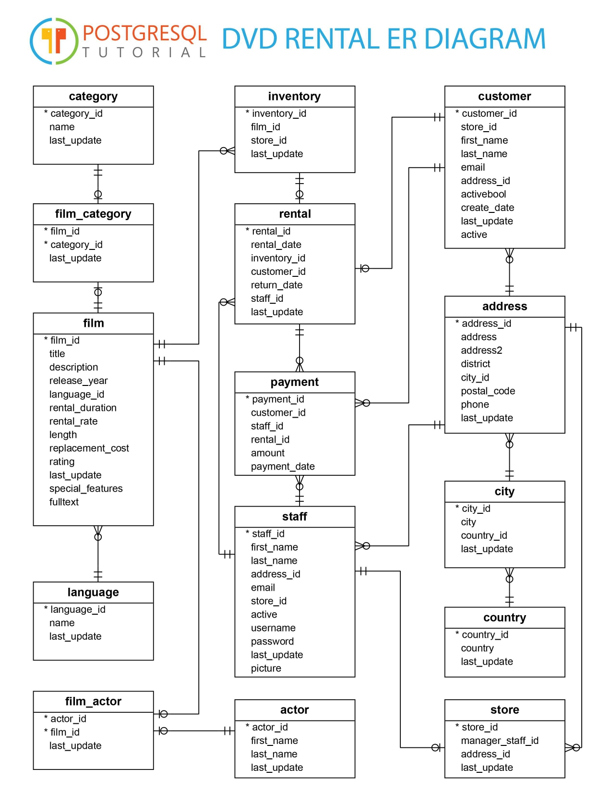
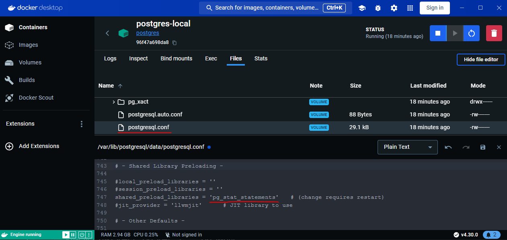

# Работа с join'ами и статистикой

### Подготовка кластера и базы данных

Скачал демо [базу данных](https://www.postgresqltutorial.com/postgresql-getting-started/postgresql-sample-database/) по фильмам. Схема у нее такая:



Запустим образ `postgres` в `docker` и смонтируем туда папку с бэкапом демо базы данных

```pwsh
docker run -d --name postgres-local -e POSTGRES_PASSWORD=123123 -v D:\Work\docker\:/home/backups postgres
```

Восстановим базу данных из бэкапа по [документации](https://www.postgresql.org/docs/7.3/app-pgrestore.html)
```pwsh
PS C:> docker exec -i postgres-local pg_restore -U postgres -d postgres -v "/home/backups/dvdrental.tar"
pg_restore: connecting to database for restore
pg_restore: creating TYPE "public.mpaa_rating"
pg_restore: creating DOMAIN "public.year"
pg_restore: creating FUNCTION "public._group_concat(text, text)"
pg_restore: creating FUNCTION "public.film_in_stock(integer, integer)"
pg_restore: creating FUNCTION "public.film_not_in_stock(integer, integer)"
pg_restore: creating FUNCTION "public.get_customer_balance(integer, timestamp without time zone)"
pg_restore: creating FUNCTION "public.inventory_held_by_customer(integer)"
pg_restore: creating FUNCTION "public.inventory_in_stock(integer)"
...
pg_restore: creating FK CONSTRAINT "public.store store_manager_staff_id_fkey"
```

Подключимся к базе данных, выведем список таблиц и сделай простую выборку данных

```pwsh
PS C:> docker exec -it postgres-local psql -U postgres -d postgres
psql (16.3 (Debian 16.3-1.pgdg120+1))
Type "help" for help.
```

```sql
postgres=# \dt
             List of relations
 Schema |     Name      | Type  |  Owner
--------+---------------+-------+----------
 public | actor         | table | postgres
 public | address       | table | postgres
 public | category      | table | postgres
 public | city          | table | postgres
 public | country       | table | postgres
 public | customer      | table | postgres
 public | film          | table | postgres
 public | film_actor    | table | postgres
 public | film_category | table | postgres
 public | inventory     | table | postgres
 public | language      | table | postgres
 public | payment       | table | postgres
 public | rental        | table | postgres
 public | staff         | table | postgres
 public | store         | table | postgres
(15 rows)

postgres=# select * from actor limit 5;
 actor_id | first_name |  last_name   |      last_update
----------+------------+--------------+------------------------
        1 | Penelope   | Guiness      | 2013-05-26 14:47:57.62
        2 | Nick       | Wahlberg     | 2013-05-26 14:47:57.62
        3 | Ed         | Chase        | 2013-05-26 14:47:57.62
        4 | Jennifer   | Davis        | 2013-05-26 14:47:57.62
        5 | Johnny     | Lollobrigida | 2013-05-26 14:47:57.62
(5 rows)
```

Включим расширение `pg_stat_statements` для сбора статистики через `postgresql.conf` и перезагрузим сервер

```sql
postgres=# CREATE EXTENSION pg_stat_statements;
CREATE EXTENSION
```



Перезапустим сервер `postgres`, перезапустив контейнер

```pwsh
PS C:> docker restart postgres-local
postgres-local
```

Для более красивого вывода выполним

```sql
postgres=# \x auto
```

Посмотрим статистику

```sql
postgres=# select * from pg_stat_statements;

-[ RECORD 1 ]----------+---------------------------------
userid                 | 10
dbid                   | 5
toplevel               | t
queryid                | 4084724914282687734
query                  | select * from pg_stat_statements
plans                  | 0
total_plan_time        | 0
min_plan_time          | 0
max_plan_time          | 0
mean_plan_time         | 0
stddev_plan_time       | 0
calls                  | 2
total_exec_time        | 0.091643
min_exec_time          | 0.030787999999999996
max_exec_time          | 0.060855
mean_exec_time         | 0.0458215
stddev_exec_time       | 0.0150335
...
```

### Прямое соединение двух или более таблиц

Выведем три фильма, которые дольше всего находились в аренде на момент `2005-08-24 18:00:00`

```sql
postgres=# select r.rental_date, f.title, f.release_year from rental r
join inventory i on i.inventory_id = r.inventory_id
join film f on f.film_id = i.film_id
where r.rental_date <= '2005-08-24 18:00:00' and r.return_date > '2005-08-24 18:00:00'
order by r.rental_date
limit 3;
     rental_date     |       title        | release_year
---------------------+--------------------+--------------
 2005-08-16 22:52:54 | Butterfly Chocolat |         2006
 2005-08-16 23:01:22 | Sweden Shining     |         2006
 2005-08-16 23:10:34 | Fool Mockingbird   |         2006
(3 rows)
```

Посмотрим план запроса. Тут видно, что данные фильтруются по `rental_date` по индексу `idx_unq_rental_rental_date_inventory_id_customer_id`, потом полученный набор фильтрует `return_date`. Затем `nested loop` соединяет `rental` и `inventory`, а затем внешний `nested loop` соединяет данные с `film`. В конце все этой ограничивается действием `limit`. Почитал немного про `memoize`, если правильно понял, то это кэширование, чтобы не бегать каждый раз в присоединяемую таблицу по ключу, но так как у меня все три записи уникальные, то он пишет везде `Misses: 3`, так как только один раз добавляет запись в кэш и больше не использует

```sql
 Limit  (cost=0.86..3.42 rows=3 width=27) (actual time=0.916..0.927 rows=3 loops=1)
   ->  Nested Loop  (cost=0.86..2149.41 rows=2525 width=27) (actual time=0.915..0.926 rows=3 loops=1)
         ->  Nested Loop  (cost=0.58..1728.20 rows=2525 width=10) (actual time=0.911..0.917 rows=3 loops=1)
               ->  Index Scan using idx_unq_rental_rental_date_inventory_id_customer_id on rental r  (cost=0.29..914.38 rows=2525 width=12) (actual time=0.904..0.905 rows=3 loops=1)
                     Index Cond: (rental_date <= '2005-08-24 18:00:00'::timestamp without time zone)
                     Filter: (return_date > '2005-08-24 18:00:00'::timestamp without time zone)
                     Rows Removed by Filter: 11495
               ->  Memoize  (cost=0.29..0.37 rows=1 width=6) (actual time=0.004..0.004 rows=1 loops=3)
                     Cache Key: r.inventory_id
                     Cache Mode: logical
                     Hits: 0  Misses: 3  Evictions: 0  Overflows: 0  Memory Usage: 1kB
                     ->  Index Scan using inventory_pkey on inventory i  (cost=0.28..0.36 rows=1 width=6) (actual time=0.002..0.002 rows=1 loops=3)
                           Index Cond: (inventory_id = r.inventory_id)
         ->  Memoize  (cost=0.29..0.38 rows=1 width=23) (actual time=0.002..0.002 rows=1 loops=3)
               Cache Key: i.film_id
               Cache Mode: logical
               Hits: 0  Misses: 3  Evictions: 0  Overflows: 0  Memory Usage: 1kB
               ->  Index Scan using film_pkey on film f  (cost=0.28..0.37 rows=1 width=23) (actual time=0.002..0.002 rows=1 loops=3)
                     Index Cond: (film_id = i.film_id)
 Planning Time: 0.256 ms
 Execution Time: 0.961 ms
(21 rows)
```

Поглядим статистику запроса. Видно, что было 17 запросов и что много попаданий в разделяемый кэш (`shared_blks_hit`)

```sql
postgres=# select * from pg_stat_statements where query like 'select r.rental_date, f.title, f.release_year%';

userid                 | 10
dbid                   | 5
toplevel               | t
queryid                | -1377807132664238572
query                  | select r.rental_date, f.title, f.release_year from rental r+
                       | join inventory i on i.inventory_id = r.inventory_id        +
                       | join film f on f.film_id = i.film_id                       +
                       | where r.rental_date <= $1 and r.return_date > $2           +
                       | order by r.rental_date                                     +
                       | limit $3
plans                  | 0
total_plan_time        | 0
min_plan_time          | 0
max_plan_time          | 0
mean_plan_time         | 0
stddev_plan_time       | 0
calls                  | 17
total_exec_time        | 16.075197
min_exec_time          | 0.9171389999999999
max_exec_time          | 0.977133
mean_exec_time         | 0.9455998235294119
stddev_exec_time       | 0.015014798242499811
rows                   | 51
shared_blks_hit        | 2941
shared_blks_read       | 0
shared_blks_dirtied    | 0
shared_blks_written    | 0
local_blks_hit         | 0
local_blks_read        | 0
local_blks_dirtied     | 0
local_blks_written     | 0
temp_blks_read         | 0
temp_blks_written      | 0
blk_read_time          | 0
blk_write_time         | 0
temp_blk_read_time     | 0
temp_blk_write_time    | 0
wal_records            | 0
wal_fpi                | 0
wal_bytes              | 0
jit_functions          | 0
jit_generation_time    | 0
jit_inlining_count     | 0
jit_inlining_time      | 0
jit_optimization_count | 0
jit_optimization_time  | 0
jit_emission_count     | 0
jit_emission_time      | 0
```

### Левостороннее соединение двух или более таблиц

Выведем информацию о том, какие копии фильма `Whale Bikini` и кому выданы в аренду на момент `2005-05-25 10:00:00`

```sql
postgres=# select f.film_id, f.title, i.inventory_id, i.store_id, r.customer_id from film f
left join inventory i on i.film_id = f.film_id
left join (
    select inventory_id, customer_id from rental
    where rental_date <= '2005-05-25 10:00:00' and return_date > '2005-05-25 10:00:00') r on r.inventory_id = i.inventory_id
where f.title = 'Whale Bikini';
 film_id |    title     | inventory_id | store_id | customer_id
---------+--------------+--------------+----------+-------------
     971 | Whale Bikini |         4441 |        1 |         438
     971 | Whale Bikini |         4442 |        1 |
     971 | Whale Bikini |         4443 |        1 |         142
     971 | Whale Bikini |         4444 |        1 |
(4 rows)
```

По результатам видно, что всего есть четыре копии фильма, все они в первом магазине. На момент `2005-05-25 10:00:00` две копии были выданы в аренду покупателям с `customer_id` равным 438 и 142. По другим копиям на этот момент заказа не было. Так как используем `left join`, в результате получаем строки с пустым `customer_id`, что указывает, что данных об аренде нет на этот момент по копии фильма

Посмотрим план запроса

```sql
 Nested Loop Left Join  (cost=8.59..93.91 rows=5 width=27) (actual time=0.417..0.447 rows=4 loops=1)
   ->  Hash Right Join  (cost=8.30..91.20 rows=5 width=25) (actual time=0.411..0.425 rows=4 loops=1)
         Hash Cond: (i.film_id = f.film_id)
         ->  Seq Scan on inventory i  (cost=0.00..70.81 rows=4581 width=8) (actual time=0.004..0.188 rows=4581 loops=1)
         ->  Hash  (cost=8.29..8.29 rows=1 width=19) (actual time=0.013..0.013 rows=1 loops=1)
               Buckets: 1024  Batches: 1  Memory Usage: 9kB
               ->  Index Scan using idx_title on film f  (cost=0.28..8.29 rows=1 width=19) (actual time=0.010..0.011 rows=1 loops=1)
                     Index Cond: ((title)::text = 'Whale Bikini'::text)
   ->  Index Scan using idx_fk_inventory_id on rental  (cost=0.29..0.53 rows=1 width=6) (actual time=0.003..0.005 rows=0 loops=4)
         Index Cond: (inventory_id = i.inventory_id)
         Filter: ((rental_date <= '2005-05-25 10:00:00'::timestamp without time zone) AND (return_date > '2005-05-25 10:00:00'::timestamp without time zone))
         Rows Removed by Filter: 4
 Planning Time: 0.295 ms
 Execution Time: 0.466 ms
(14 rows)
```

Тут выглядит так, что сначала идет `index scan` по `idx_title` для названия `Whale Bikini` и создается временная `hash` таблица. После чего идет `hash right join` по `film_id` между `film` и `inventory`, при этом `film` представляет уже отфильтрованная по названию временная `hash` таблица, а `inventory` получается через `seq scan`. Используется `right join` так как поменялся порядок таблиц от того, что в запросе. Далее берется фильтрованный по датам набор данных из `rental` и по индексу `idx_fk_inventory_id` через `nested loop left join` присоединяется к ранее созданному набору данных между `film` и `inventory`

Посмотрим статистику

```sql
userid                 | 10
dbid                   | 5
toplevel               | t
queryid                | 3294631042273165665
query                  | select f.film_id, f.title, i.inventory_id, i.store_id, r.customer_id from film f      +
                       | left join inventory i on i.film_id = f.film_id                                        +
                       | left join (                                                                           +
                       |     select inventory_id, customer_id from rental                                      +
                       |     where rental_date <= $1 and return_date > $2) r on r.inventory_id = i.inventory_id+
                       | where f.title = $3
plans                  | 0
total_plan_time        | 0
min_plan_time          | 0
max_plan_time          | 0
mean_plan_time         | 0
stddev_plan_time       | 0
calls                  | 9
total_exec_time        | 2.5100979999999997
min_exec_time          | 0.25684
max_exec_time          | 0.352435
mean_exec_time         | 0.27889977777777775
stddev_exec_time       | 0.02901677535410539
rows                   | 36
shared_blks_hit        | 486
shared_blks_read       | 0
shared_blks_dirtied    | 0
shared_blks_written    | 0
```

### Кросс соединение двух или более таблиц

Выберем все пары актеров, которые могли бы играть вместе с именами `Sandra` и `Fay`

```sql
postgres=# select a1.last_name, a1.first_name, a2.last_name, a2.first_name from actor a1
cross join actor a2
where a1.first_name = 'Sandra' and a2.first_name = 'Fay';

 last_name | first_name | last_name | first_name
-----------+------------+-----------+------------
 Kilmer    | Sandra     | Kilmer    | Fay
 Peck      | Sandra     | Kilmer    | Fay
 Kilmer    | Sandra     | Winslet   | Fay
 Peck      | Sandra     | Winslet   | Fay
 Kilmer    | Sandra     | Wood      | Fay
 Peck      | Sandra     | Wood      | Fay
(6 rows)
```

Посмотрим план. Видим, что таблица сканируется два раза с разным фильтром и затем объединяется результат обычным `nested loop`

```sql
 Nested Loop  (cost=0.00..9.08 rows=6 width=26) (actual time=0.017..0.033 rows=6 loops=1)
   ->  Seq Scan on actor a2  (cost=0.00..4.50 rows=3 width=13) (actual time=0.012..0.018 rows=3 loops=1)
         Filter: ((first_name)::text = 'Fay'::text)
         Rows Removed by Filter: 197
   ->  Materialize  (cost=0.00..4.51 rows=2 width=13) (actual time=0.001..0.004 rows=2 loops=3)
         ->  Seq Scan on actor a1  (cost=0.00..4.50 rows=2 width=13) (actual time=0.003..0.011 rows=2 loops=1)
               Filter: ((first_name)::text = 'Sandra'::text)
               Rows Removed by Filter: 198
 Planning Time: 0.060 ms
 Execution Time: 0.048 ms
(10 rows)
```

Посмотрим статистику

```sql
userid                 | 10
dbid                   | 5
toplevel               | t
queryid                | 3869259316955542233
query                  | select a1.last_name, a1.first_name, a2.last_name, a2.first_name from actor a1+
                       | cross join actor a2 where a1.first_name = $1 and a2.first_name = $2
plans                  | 0
total_plan_time        | 0
min_plan_time          | 0
max_plan_time          | 0
mean_plan_time         | 0
stddev_plan_time       | 0
calls                  | 1
total_exec_time        | 0.03761
min_exec_time          | 0.03761
max_exec_time          | 0.03761
mean_exec_time         | 0.03761
stddev_exec_time       | 0
rows                   | 6
shared_blks_hit        | 4
shared_blks_read       | 0
shared_blks_dirtied    | 0
shared_blks_written    | 0
```

### Полное соединение двух или более таблиц

Выберем список всех языков, на которых есть фильм 'Whale Bikini' с отображением тех, на каких его нет

```sql
postgres=# select f.title, l.name from film f
full join language l on l.language_id = f.language_id
where f.title = 'Whale Bikini' or f.title is null;
    title     |         name
--------------+----------------------
 Whale Bikini | English
              | Italian
              | French
              | German
              | Mandarin
              | Japanese
(6 rows)
```

Посмотрим план и статистику. Делается `seq scan` по `language` и строится на его основе временнная `hash` таблица. Выполняется `hash full join` с `film` и фильтруется по `title`

```sql
Hash Full Join  (cost=1.14..104.04 rows=1 width=99) (actual time=0.288..0.305 rows=6 loops=1)
   Hash Cond: (f.language_id = l.language_id)
   Filter: (((f.title)::text = 'Whale Bikini'::text) OR (f.title IS NULL))
   Rows Removed by Filter: 999
   ->  Seq Scan on film f  (cost=0.00..98.00 rows=1000 width=17) (actual time=0.005..0.124 rows=1000 loops=1)
   ->  Hash  (cost=1.06..1.06 rows=6 width=88) (actual time=0.034..0.034 rows=6 loops=1)
         Buckets: 1024  Batches: 1  Memory Usage: 9kB
         ->  Seq Scan on language l  (cost=0.00..1.06 rows=6 width=88) (actual time=0.010..0.011 rows=6 loops=1)
 Planning Time: 0.083 ms
 Execution Time: 0.340 ms
(10 rows)
```

```sql
userid                 | 10
dbid                   | 5
toplevel               | t
queryid                | 7916256916715770739
query                  | select f.title, l.name from film f                   +
                       | full join language l on l.language_id = f.language_id+
                       | where f.title = $1 or f.title is null
plans                  | 0
total_plan_time        | 0
min_plan_time          | 0
max_plan_time          | 0
mean_plan_time         | 0
stddev_plan_time       | 0
calls                  | 1
total_exec_time        | 0.24691999999999997
min_exec_time          | 0.24691999999999997
max_exec_time          | 0.24691999999999997
mean_exec_time         | 0.24691999999999997
stddev_exec_time       | 0
rows                   | 6
shared_blks_hit        | 89
shared_blks_read       | 0
shared_blks_dirtied    | 0
shared_blks_written    | 0
```

### Несколько типов соединения в одном запросе

Не придумал ничего реалистичного с `full join` и `cross join`, поэтому сделал обычный запрос, которые часто встречаются в работе

Получим данные о фильмах, которые взяли в аренду 14 июня 2005 года

```sql
postgres=# select r.rental_id, f.title, c.last_name, c.first_name, p.amount from rental r
inner join inventory i on i.inventory_id = r.inventory_id
inner join film f on f.film_id = i.film_id
inner join customer c on c.customer_id = r.customer_id
left join payment p on p.rental_id = r.rental_id
where r.rental_date >= '2005-06-14 00:00:00' and r.rental_date < '2005-06-15 00:00:00';
 rental_id |        title        | last_name | first_name | amount
-----------+---------------------+-----------+------------+--------
      1158 | Giant Troopers      | Pinson    | Jeffery    |   2.99
      1159 | Wash Heavenly       | Noe       | Elmer      |   4.99
      1160 | Name Detective      | Romero    | Minnie     |   4.99
      1161 | Goodfellas Salute   | Mckinney  | Miriam     |
      1162 | Deer Virginian      | Cabral    | Daniel     |
      1163 | Truman Crazy        | Roush     | Terrance   |   6.99
      1164 | Sleuth Orient       | Edwards   | Joyce      |   0.99
      1165 | None Spiking        | May       | Gwendolyn  |   3.99
      1166 | Maiden Home         | Campbell  | Catherine  |   4.99
      1167 | Talented Homicide   | Mahan     | Matthew    |
      1168 | Wagon Jaws          | Devore    | Herman     |   2.99
      1169 | Divine Resurrection | Dixon     | Amber      |   2.99
      1170 | Lost Bird           | Gunderson | Terrence   |   2.99
      1171 | Tights Dawn         | Gregory   | Sonia      |
      1172 | Modern Dorado       | Kowalski  | Charles    |
      1173 | Disturbing Scarface | Greene    | Jeanette   |   2.99
(16 rows)
```

Посмотрим план и статистику. По плану все как обычно, сканируем индексы и циклом объединяем `rental` и `inventory`, потом присоединяем таким же способом `film`. Присоединяем получившееся к `customer` через временную `hash` таблицу. В конце делаем в цикле `left join` c `rental`

```sql
 Nested Loop Left Join  (cost=23.61..219.46 rows=11 width=38) (actual time=0.117..0.190 rows=16 loops=1)
   ->  Hash Join  (cost=23.32..132.03 rows=11 width=32) (actual time=0.115..0.171 rows=16 loops=1)
         Hash Cond: (r.customer_id = c.customer_id)
         ->  Nested Loop  (cost=0.84..109.52 rows=11 width=21) (actual time=0.015..0.069 rows=16 loops=1)
               ->  Nested Loop  (cost=0.57..105.41 rows=11 width=8) (actual time=0.013..0.045 rows=16 loops=1)
                     ->  Index Scan using idx_unq_rental_rental_date_inventory_id_customer_id on rental r  (cost=0.29..26.10 rows=11 width=10) (actual time=0.007..0.009 rows=16 loops=1)
                           Index Cond: ((rental_date >= '2005-06-14 00:00:00'::timestamp without time zone) AND (rental_date < '2005-06-15 00:00:00'::timestamp without time zone))
                     ->  Index Scan using inventory_pkey on inventory i  (cost=0.28..7.21 rows=1 width=6) (actual time=0.002..0.002 rows=1 loops=16)
                           Index Cond: (inventory_id = r.inventory_id)
               ->  Index Scan using film_pkey on film f  (cost=0.28..0.37 rows=1 width=19) (actual time=0.001..0.001 rows=1 loops=16)
                     Index Cond: (film_id = i.film_id)
         ->  Hash  (cost=14.99..14.99 rows=599 width=17) (actual time=0.096..0.096 rows=599 loops=1)
               Buckets: 1024  Batches: 1  Memory Usage: 39kB
               ->  Seq Scan on customer c  (cost=0.00..14.99 rows=599 width=17) (actual time=0.005..0.046 rows=599 loops=1)
   ->  Index Scan using idx_fk_rental_id on payment p  (cost=0.29..7.94 rows=1 width=10) (actual time=0.001..0.001 rows=1 loops=16)
         Index Cond: (rental_id = r.rental_id)
 Planning Time: 0.449 ms
 Execution Time: 0.214 ms
(18 rows)
```

```sql
userid                 | 10
dbid                   | 5
toplevel               | t
queryid                | -5666875308490962311
query                  | select r.rental_id, f.title, c.last_name, c.first_name, p.amount from rental r+
                       | inner join inventory i on i.inventory_id = r.inventory_id                     +
                       | inner join film f on f.film_id = i.film_id                                    +
                       | inner join customer c on c.customer_id = r.customer_id                        +
                       | left join payment p on p.rental_id = r.rental_id                              +
                       | where r.rental_date >= $1 and r.rental_date < $2
plans                  | 0
total_plan_time        | 0
min_plan_time          | 0
max_plan_time          | 0
mean_plan_time         | 0
stddev_plan_time       | 0
calls                  | 1
total_exec_time        | 0.176395
min_exec_time          | 0.176395
max_exec_time          | 0.176395
mean_exec_time         | 0.176395
stddev_exec_time       | 0
rows                   | 16
shared_blks_hit        | 151
shared_blks_read       | 0
shared_blks_dirtied    | 0
shared_blks_written    | 0
```